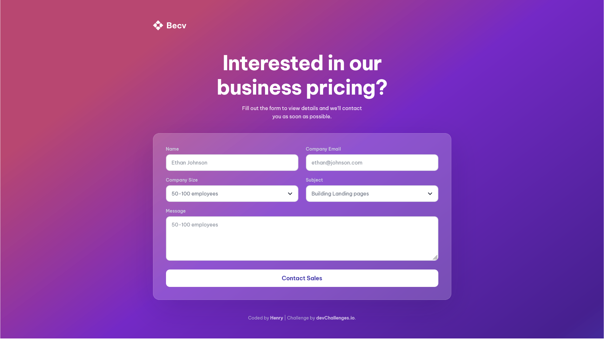

<!-- Please update value in the {}  -->

<h1 align="center">Contact page</h1>

<div align="center">
   Solution for a challenge <a href="https://devchallenges.io/challenge/contact-page" target="_blank">Contact Page</a> from <a href="http://devchallenges.io" target="_blank">devChallenges.io</a>.
</div>

<div align="center">
  <h3>
    <a href="{https://your-demo-link.your-domain}">
      Demo
    </a>
    <span> | </span>
    <a href="https://github.com/Henrydevlab/contact-page">
      Solution
    </a>    
  </h3>
</div>

<!-- TABLE OF CONTENTS -->

## Table of Contents

- [Overview](#overview)
  - [What I learned](#what-i-learned)
  - [Useful resources](#useful-resources)
- [Built with](#built-with)
- [Features](#features)
- [Author](#author)

## Overview



### What I learned

Working through this project provided valuable practice in merging modern styling with strict accessibility standards:

- **Far-Left Desktop Alignment via Max-Width Boundaries:** Learned to manipulate nested container layouts so elements like the brand logo drop gracefully into a centralized column layout on mobile, yet expand to align precisely on the far-left grid boundary on large monitors.
- **Strict Accessibility (WCAG 2.1 Compliance):** Implemented explicit programmatic connection pairings between `label` and input elements, used `aria-required` for select options, and added `:focus-visible` outlines to ensure seamless keyboard-only navigation.
- **Custom Select Arrow Mapping:** Used CSS `appearance: none` to strip default browser select designs and layered the custom vector dropdown arrow seamlessly into place utilizing absolute positioning inside a wrapper component:

```css
.contact-form__select {
  appearance: none;
  -webkit-appearance: none;
  -moz-appearance: none;
  padding-right: 44px;
  cursor: pointer;
}

.contact-form__select-wrapper::after {
  content: "";
  position: absolute;
  right: 18px;
  top: 50%;
  transform: translateY(-50%);
  width: 16px;
  height: 16px;
  background-image: url('resources/Expand_down.svg');
  background-repeat: no-repeat;
  background-position: center;
  pointer-events: none;
}

```
### Useful resources

- [MDN Web Docs -Styling HTML Forms](https://developer.mozilla.org/en-US/docs/Learn_web_development/Extensions/Forms/Styling_web_forms) - An excellent comprehensive reference guide on stripping native OS select inputs safely without breaking core interactions.
- [A Complete Guide to CSS Grid](https://css-tricks.com/complete-guide-css-grid-layout/) - Essential for mapping the form layout fields across 2 equal columns dynamically across larger screen rows.

### Built with

- Semantic HTML5 markup
- CSS custom properties
- Flexbox
- CSS Grid
- BEM (Block Element Modifier) Methodology
- Mobile-First Responsive Design Flow

## Features

- **Pixel-Perfect Responsiveness**: Flawless cross-device rendering mapping exact design specs for 412px (Mobile), 1024px (Tablet), and 1350px+ (Desktop) displays.
- **SEO & Social Optimization**: Complete integration of explicit technical meta description structures, keywords, and Open Graph card configurations.
- **Interactive Forms**: Native HTML5 validation built over true non-hardcoded placeholder attributes that vanish instantly when a user clicks and starts typing.
- **Accessible Landmarks**: Perfectly structured headings and landmark layers optimized fully for screen reader navigation hierarchies.

## Author

- GitHub [@henrydevlab](https://github.com/henrydevlab)
